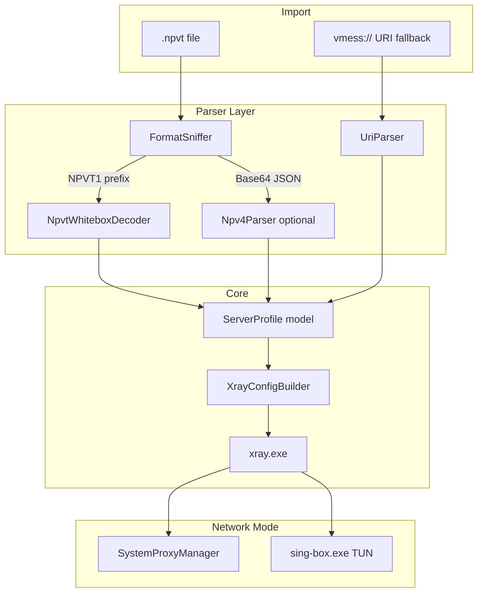

# سند فازبندی‌شده: NapsternetV Desktop Client (C# / WPF)

## نتیجه مقایسه دو Agent

| موضوع | Agent 1 | Agent 2 | تصمیم نهایی |
|-------|---------|---------|-------------|
| **فرمت `.npvt`** | White-box AES CTR، prefix `NPVT1`، ~200KB جدول | Base64 → JSON → AES-256-CBC | **Agent 1 درست است** — با [Pantegnos/config-breaker](https://github.com/FrontierTM/Pantegnos) هم‌خوان است |
| **فرمت `.npv4`** | ذکر نشده | Base64 + wrapper JSON + AES | **به‌عنوان parser جدا** — بعد از `.npvt`، با تست واقعی |
| **TUN روی Windows** | Xray built-in tun (تک پروسه) | sing-box → SOCKS محلی Xray | **Agent 2 درست است** — v2rayN همین الگو را استفاده می‌کند؛ Xray tun روی Windows ناپایدار است |
| **معماری + کد** | فقط گزارش تحقیق | Solution کامل (~4000 خط) | **پایه = Agent 2** |
| **Fallback URI** | ذکر نشده | `vmess://` / `vless://` / ... | **اضافه شود** — برای تست قبل از parser |
| **SSH** | — | MVP: نادیده گرفته | **موافق** |

**جمع‌بندی:** به Agent 2 بدهید توسعه دهد، **اما** لایه Parser را قبل از هر چیز اصلاح کنید. چون شما فقط `.npvt` دارید، پیاده‌سازی AES در Agent 2 برای MVP شما **کار نمی‌کند**.

---

## آیا اصلاً شدنی است؟

**بله — با C# (.NET 9/10 + WPF) کاملاً شدنی است.** Python فقط در بدترین حالت (مثلاً اسکریپت کمکی) لازم است؛ ترجیح: **C# + یک helper Go کوچک** برای decrypt.



---

## تصمیم‌های فنی کلیدی (با اصلاحات پیشنهادی)

1. **Stack:** C# WPF + MVVM (`CommunityToolkit.Mvvm`) + `.NET 9` (پایدار) — اگر SDK 10 دارید `net10.0-windows` هم OK
2. **Engine:** `xray.exe` برای پروتکل‌ها (VMess/VLESS/Trojan/SS/SOCKS)
3. **TUN:** `sing-box.exe` + `wintun.dll` — sing-box به SOCKS محلی Xray (`127.0.0.1:10808`) forward می‌کند
4. **System Proxy:** Registry `HKCU\...\Internet Settings` + `InternetSetOption` P/Invoke
5. **`.npvt` decrypt (پیشنهاد من — Hybrid):**
   - **فاز 2:** bundle `npvt-decoder.exe` (build از Pantegnos Go) — سریع‌ترین مسیر به MVP
   - **فاز 6 (اختیاری):** پورت native C# جداول white-box برای حذف وابستگی Go
6. **Admin elevation:** فقط برای TUN لازم است — **اصلاح Agent 2:** manifest پیش‌فرض `asInvoker` + درخواست UAC فقط هنگام انتخاب TUN (UX بهتر از `requireAdministrator` همیشگی)
7. **امنیت:** credential در log نباشد؛ profile با **DPAPI** encrypt شود (اضافه نسبت به Agent 2)
8. **SSH:** فاز بعد — Xray پشتیبانی نمی‌کند

---

## ساختار پروژه (بر اساس Agent 2 + اصلاح Parser)

مسیر پیشنهادی در workspace: [`D:/napsterProject`](D:/napsterProject)

```
NapsternetVClient/
├── NapsternetVClient.sln
└── src/NapsternetVClient/
    ├── Models/          # ServerProfile, ConnectionMode, ...
    ├── Parsers/
    │   ├── IConfigParser.cs
    │   ├── FormatSniffer.cs          # NEW: تشخیص npvt vs npv4 vs URI
    │   ├── NpvtDecoder.cs          # NEW: white-box (CLI wrapper)
    │   ├── NpvParser.cs              # فقط npv/npv2/npv4 (AES path)
    │   ├── UriParser.cs
    │   └── ParserFactory.cs
    ├── Converters/      # XrayConfigBuilder
    ├── Core/            # XrayProcessManager, SingBoxProcessManager, BinaryManager, ProcessGuard
    ├── Network/         # SystemProxyManager, TunManager
    ├── Services/        # ConnectionService, ProfileService
    ├── ViewModels/ + Views/
    ├── Utilities/       # CryptoHelper (npv4 only), Constants
    └── Resources/bin/   # xray, sing-box, wintun, npvt-decoder
```

---

## فازهای پیاده‌سازی

### فاز 0 — آماده‌سازی و اعتبارسنجی (۱–۲ روز)

**هدف:** قبل از کدنویسی، parser `.npvt` را با فایل واقعی شما verify کنیم.

- نصب [.NET 9 SDK](https://dotnet.microsoft.com/download)
- دانلود release [Pantegnos](https://github.com/FrontierTM/Pantegnos) و تست decrypt فایل `.npvt` شما:
  ```powershell
  .\Pantegnos.exe -input "sample.npvt" -output "out\"
  ```
- خروجی JSON را بررسی کنید: protocol، address، port، transport (ws/grpc/tls)
- **معیار موفقیت:** JSON معتبر با فیلدهای سرور (بدون نیاز به share credential در chat)

**خروجی:** سند کوچک `docs/npvt-sample-structure.json` (sanitized) + لیست فیلدهایی که باید به `ServerProfile` map شوند.

---

### فاز 1 — MVP: System Proxy + URI (۳–۵ روز)

**هدف:** اول اتصال واقعی — بدون وابستگی به `.npvt`.

از کد Agent 2 استفاده کنید اما **فقط این بخش‌ها:**

| کامپوننت | فایل‌های مرجع در txt |
|----------|---------------------|
| Project setup | `NapsternetVClient.csproj`, `app.manifest` (با `asInvoker`) |
| Models | `ConnectionMode`, `ConnectionState`, `ServerProfile` |
| URI Parser | `VmessUriParser` / `UriParser` |
| Xray builder | `XrayConfigBuilder` |
| Process | `XrayProcessManager`, `BinaryManager` |
| Proxy | `SystemProxyManager`, `NetworkInterop` |
| UI MVP | `MainWindow`, `MainViewModel` — Import URI, Connect/Disconnect, Logs |

**BinaryManager** در اولین اجرا دانلود کند:
- `xray.exe` از [XTLS/Xray-core releases](https://github.com/XTLS/Xray-core/releases)
- `geoip.dat` / `geosite.dat` از [Loyalsoldier/v2ray-rules-dat](https://github.com/Loyalsoldier/v2ray-rules-dat/releases)

**تست:**
- Import یک `vless://` یا `vmess://` معتبر
- Connect → `ifconfig.me` IP عوض شود
- Disconnect → proxy registry پاک شود
- Kill app → `ProcessGuard` + mutex file cleanup

---

### فاز 2 — Import `.npvt` (۵–۷ روز) — **بحرانی برای شما**

**هدف:** import فایل `.npvt` واقعی.

**گام‌ها:**

1. **`FormatSniffer`:** اگر content با `NPVT1` شروع شد یا extension `.npvt` → مسیر white-box
2. **`NpvtDecoder`:** wrapper دور `npvt-decoder.exe`:
   ```csharp
   // pseudo
   Process.Start("npvt-decoder.exe", $"--input \"{path}\" --output \"{tempJson}\"");
   ```
3. Map JSON خروجی → `ServerProfile` (vmess/vless/trojan/ss)
4. UI: دکمه Import File + dialog password (اگر locked بود)
5. **Unit test:** فایل `.npvt` شما → JSON → ServerProfile (بدون log کردن secret)

**نکته:** اگر Pantegnos برای فایل locked شما password می‌خواهد، همان flow را در UI تکرار کنید.

**Fallback chain:**
```
.npvt → NpvtDecoder → fail → پیام واضح + پیشنهاد URI
```

---

### فاز 3 — پشتیبانی `.npv4` / `.npv2` (۲–۴ روز، اختیاری)

- Parser AES از Agent 2 (`NpvParser` + `CryptoHelper`) — **فقط** وقتی FormatSniffer Base64+JSON wrapper detect کند
- چند strategy decrypt (همان `TryDecryptNpvData`) — confidence متوسط
- تست با فایل npv4 در صورت داشتن

---

### فاز 4 — TUN Mode با sing-box (۵–۷ روز)

**معماری (از Agent 2):**

1. Xray بالا بیاید با SOCKS `127.0.0.1:10808`
2. sing-box config generate:
   - `tun` inbound + `route` + DNS hijack
   - outbound `socks` → `127.0.0.1:10808`
3. **UAC elevation** فقط در Connect با mode=TUN
4. Route loop prevention: IP سرور proxy از physical adapter برود (rule direct)
5. Disconnect: stop sing-box → stop xray → restore routes

**BinaryManager اضافه کند:**
- `sing-box.exe` از [SagerNet/sing-box releases](https://github.com/SagerNet/sing-box/releases)
- `wintun.dll` از [wintun.net](https://www.wintun.net/)

**تست:**
- `dnsleaktest.com`
- ping/traceroute
- app غیر-browser (مثلاً `curl` در PowerShell)

---

### فاز 5 — Production Hardening (۳–۵ روز)

| مورد | توضیح |
|------|-------|
| **ProcessGuard** | cleanup روی crash، mutex `.connected` |
| **Kill-switch** | optional: block direct traffic اگر tunnel down شد |
| **System tray** | `Hardcodet.NotifyIcon.Wpf` — minimize, quick disconnect |
| **DPAPI** | encrypt `profiles.json` credentials |
| **Logging** | redact UUID/password در log pipeline |
| **SHA256 verify** | checksum binary های دانلود شده |
| **Legal disclaimer** | هشدار config اشتراکی / سرور ناشناس در اولین اجرا |

---

### فاز 6 — اختیاری: پورت C# white-box (۱–۲ هفته)

- فقط اگر بخواهید `npvt-decoder.exe` حذف شود
- Port جداول ~200KB از Pantegnos Go → static class C#
- benchmark: decrypt time + size assembly

---

## چه چیزی عمداً خارج از scope MVP

- SSH tunnel (نیاز SSH.NET یا `ssh.exe` جدا)
- Subscription URL
- Speed test / latency
- Auto-reconnect
- Split tunneling per-app

---

## پرامپت پیشنهادی برای Agent توسعه‌دهنده

این پرامپت را به Agent بدهید (ترکیب بهترین Agent 1 + 2 + اصلاحات):

```
You are a senior C#/.NET engineer building a Windows WPF VPN client.

CONTEXT:
- Use Agent 2's architecture/code as the base (WPF MVVM, XrayProcessManager, SystemProxyManager, SingBoxProcessManager, BinaryManager, ConnectionService).
- CRITICAL FIX: Agent 2's NpvParser (Base64 + AES-256-CBC) does NOT work for .npvt files.
- .npvt uses white-box AES CTR (NPVT1 prefix, ~200KB tables) per Pantegnos/config-breaker — implement via bundled npvt-decoder.exe (Go CLI) wrapped by NpvtDecoder.cs.
- TUN mode: sing-box → local Xray SOCKS (NOT Xray built-in tun on Windows).
- User has .npvt samples only — prioritize .npvt import in Phase 2.

PHASE ORDER:
0) Validate .npvt decrypt with Pantegnos on user's sample
1) MVP: URI import + System Proxy + Xray + cleanup
2) .npvt import via Go helper + JSON→ServerProfile mapping
3) Optional .npv4 AES parser
4) TUN via sing-box + wintun + UAC on demand
5) Hardening: DPAPI, kill-switch, tray, log redaction

CONSTRAINTS:
- C# WPF, .NET 9+ (net9.0-windows)
- asInvoker manifest; UAC only for TUN
- Never log passwords/UUIDs
- Defer SSH support
- Include vmess/vless/trojan/ss URI fallback

Deliver Phase 1 first as runnable code in D:\napsterProject, then Phase 2.
```

---

## ریسک‌ها و mitigation

| ریسک | احتمال | راه‌حل |
|------|--------|--------|
| `.npvt` locked با password | متوسط | UI password + تست Pantegnos |
| نسخه جدید فرمت NapsternetV | متوسط | FormatSniffer + version field + error واضح |
| sing-box/Xray API change | پایین | pin release version در BinaryManager |
| Antivirus false positive | متوسط | code signing (بعداً) + README |
| قانونی بودن VPN در منطقه کاربر | — | disclaimer در UI |

---

## معیار «Done» برای هر فاز

- **فاز 1:** Connect/Disconnect با URI + proxy cleanup verified
- **فاز 2:** Import `.npvt` شما → Connect موفق در System Proxy
- **فاز 4:** TUN mode — تمام traffic سیستم + بدون DNS leak
- **فاز 5:** crash recovery + tray + encrypted profiles
