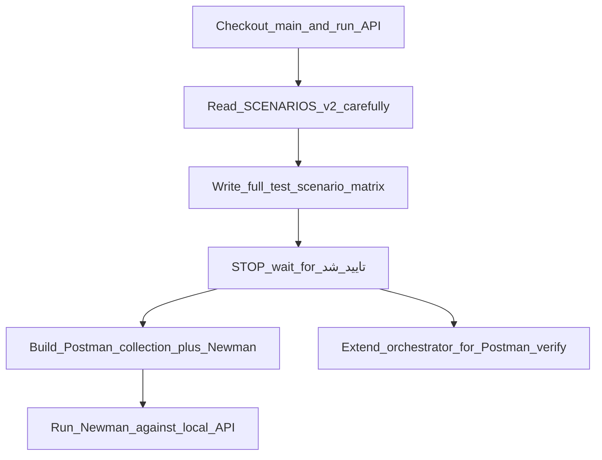

# Phase 0/1 Postman Integration + Orchestrator

## Scope (locked)

Only APIs **already implemented** on `main` (controllers present):

| Area | Prefix | SC section |
|------|--------|------------|
| Auth & Common | `/auth`, `/profile`, `/layout`, `/notifications` | SCENARIOS §1 (SC-10.*) — 14 endpoints |
| SuperAdmin | `/admin` | SCENARIOS §2 (SC-11.*) — 12 endpoints |

**Total: 26 endpoints.** Later phases (`/pm`, `/agent`, `/cm`, `/requester`) stay out until those controllers exist — collections will be structured so Phase 2+ can be added the same way.

Elay repo is **not mounted** in this Cloud VM. We reuse the Elay pattern already known from prior work + Ticket skills: scenario tables first → approval → Postman collection + Newman → coverage report. Postman MCP is `needsAuth`; delivery is **collection JSON in-repo + Newman CLI** (no MCP required to run).

## Gate flow (your request)



**Hard stop after Step C:** no Postman files until you reply `تایید شد` / `approved` on the scenario matrix.

## Step A — main + run

1. `git checkout main && git pull origin main` (local is currently behind; remote tip includes Phase 0 merge).
2. `rtk dotnet build src/Ticket/Ticket.slnx`
3. Run API: `ASPNETCORE_URLS=http://127.0.0.1:5218` Development.
4. Confirm seed login works: `superadmin` / `ChangeMe123!`.

## Step B — read contract

Read thoroughly:

- [Documents/TICKETING-SYSTEM-API-SCENARIOS-v2.md](Documents/TICKETING-SYSTEM-API-SCENARIOS-v2.md) §0 base + §1 Auth + §2 Admin
- Cross-check routes with [Documents/openapi.json](Documents/openapi.json)
- Note status-code nuances (e.g. inactive login **403**, tenant **404**)

## Step C — scenario matrix for approval (output only)

Produce **one row per test case** (happy + every documented error row), not one row per endpoint.

Columns:

| SC-id | Method + route | Role | Setup needed | Input | Expected status | Expected body/detail | Side effects |

Include at least:

**Auth/Common:** login success/401/403/400; refresh rotate + reuse 401; logout idempotent; forgot always 200; reset success/expired/used/400; profile GET/PUT/change-password; subscription 403 for SuperAdmin + 404 no sub; layout summary/unread; notifications list paging 400; mark read 404; mark-all 200.

**Admin:** dashboard; plans CRUD + deactivate; providers create (with PM user) + duplicate username 409; get/update/deactivate; subscriptions create/renew (deactivate previous); non-SuperAdmin → 403 on `/admin/*`.

Save draft as `tests/postman/PHASE0-1-SCENARIO-MATRIX.md` **only after approval** (during wait, present the matrix in chat first).

## Step D — after `تایید شد`: Postman assets (Elay-style)

Create under repo:

```
tests/postman/
  Ticket-Phase0-1.postman_collection.json
  Ticket-Local.postman_environment.json
  README.md
scripts/
  run-phase0-1-newman.sh   # or .ps1 + sh
```

Patterns to mirror from Elay:

- Env vars: `baseUrl`, `accessToken`, `refreshToken`, role users
- Collection folders by area (`Auth`, `Profile`, `Layout`, `Notifications`, `Admin`)
- Request name = `SC-id — short title`
- Pre-request / test scripts: assert status + JSON shape; chain tokens (`pm.environment.set`)
- Seed/setup folder: optional Plan→Provider→Subscription for subscription/profile tests
- Run with Newman: `npx newman run ... -e ... --reporters cli,json`

Wire into [`.cursor/skills/verify-feature/SKILL.md`](.cursor/skills/verify-feature/SKILL.md): after build, if Newman available, run Phase collection and attach coverage table.

## Step E — add orchestrator capability

Update [`.cursor/skills/orchestrator/SKILL.md`](.cursor/skills/orchestrator/SKILL.md) + [`.cursor/rules/orchestrator.mdc`](.cursor/rules/orchestrator.mdc) + [`.cursor/skills/README.md`](.cursor/skills/README.md):

| Signal | Route |
|--------|-------|
| Integration / Postman / Newman / “تست سناریو” | → **scenario-contract** (matrix) → wait approval → write/update Postman → **verify-feature** (Newman) |

Add new skill `.cursor/skills/postman-integration/SKILL.md`:

- When to use
- Matrix template
- Collection naming / SC-id mapping
- Credentials file convention (`tests/postman/README.md`)
- Newman command
- Coverage table format

Agent kickoff becomes:

```
/orchestrator
Phase: 0
Area: auth
Task: Postman integration coverage for Phase 0–1 per SCENARIOS
```

## Step F — execute Newman smoke

Against running API: full collection; fix any false failures; report Scenario Coverage (Covered / Failed / Blocked).

Commit on branch `cursor/phase-0-1-postman-3282`, push, open PR to `main`.

## Out of scope this PR

- Writing failing tests for Phase 2–6 routes
- Postman MCP cloud sync (needs your auth)
- Mounting Elay repo (if you later mount `Elay_Backend-master`, we can diff and align naming)
