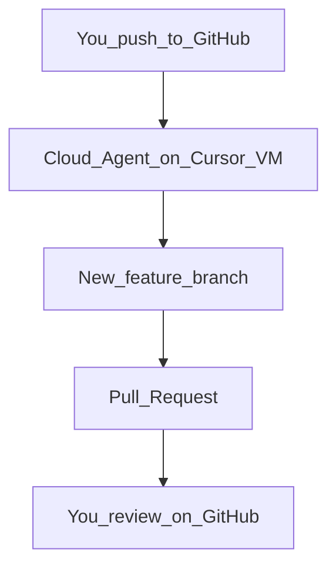

# Phase 0 — Auth & Common (Cloud-first, no Docker required)

## Does Cloud give you what you want?

**Yes.** Cursor Cloud Agents:

1. Run on **Cursor’s cloud VM** (not your laptop CPU/RAM).
2. Clone **latest from GitHub** (pushed commits).
3. Apply the requested changes on a **new branch**.
4. Open a **Pull Request** for you to review.
5. Keep working while your PC is **off**.

You do **not** need Docker on your laptop for this. Docker was only an optional way to run SQL Server; this plan uses **SQLite file DB** for Phase 0 so Cloud and local work without Docker. (Later phases can move to SQL Server / Azure when you want.)

## One-time: connect GitHub to Cursor Cloud

1. Open [https://cursor.com/dashboard](https://cursor.com/dashboard) (or Cloud Agents settings) while logged into Cursor with a **paid** plan.
2. Find **Integrations / GitHub / Connect GitHub** (admin of the Cursor account connects source control).
3. Authorize the Cursor GitHub App for org/user `AcerXO` and grant access to `ticket-please-back` (read-write).
4. Confirm on [https://cursor.com/agents](https://cursor.com/agents) that the repo appears when starting an agent.
5. Always **push** your latest work to GitHub before kicking a Cloud agent (Cloud cannot see unsaved local files).

How to start later: Cursor Desktop → agent dropdown → **Cloud**, or cursor.com/agents, or phone app — pick repo + branch (usually `main`) + task.

## Clarifying the earlier checklist (not Ticket phases 4–6)

Those were **setup steps**, not product phases:

| Step | Meaning in plain language |
|------|---------------------------|
| 1 Connect GitHub | Cursor account linked to GitHub (above) |
| 2 Environment | Cloud VM has .NET SDK (Cursor can auto-setup; no Docker needed with SQLite) |
| 3 Secrets | Optional passwords in Cloud dashboard (e.g. JWT signing key) — **not required on day one** if defaults live in `appsettings.Development.json` for Phase 0 |
| 4 Start/verify | Commands Cloud runs: `dotnet build`, maybe `dotnet test` |
| 5 Branch + PR | Agent pushes `phase-0-auth` and opens PR — **this is your review gate** |
| 6 Docs on main | `AGENTS.md` already committed so Cloud knows the rules |

Ignore Docker for now.

## Team workflow

Your job: describe Phase N + approve plan + review PR.  
Cloud job: implement off your machine.

## Contract scope (unchanged)

14 Auth/Profile/Layout/Notifications routes per SCENARIOS §1 + openapi. Status codes from SCENARIOS.

## Locked defaults

| Topic | Value |
|-------|--------|
| accessToken TTL | 15 minutes |
| refreshToken TTL | 7 days |
| CORS | `http://localhost:5173` |
| DB | **EF Core + SQLite** (`Ticket.db`) — no Docker, Cloud-friendly |
| Password reset | Stub sender; forgot always 200 |
| Hashing | `PasswordHasher<User>` |

## Architecture / implementation

Same as before: MediatR CQRS, DESIGN entities, RefreshToken, EF Admin replacing in-memory, Controllers Auth/Profile/Layout/Notifications, seed Roles + SuperAdmin, Swagger Bearer, Phase 0 DoD smoke, PR handoff.

## Out of scope

Docker/SQL Server for now; SignalR; Phase 2–6 routes; full Admin CQRS rewrite.
