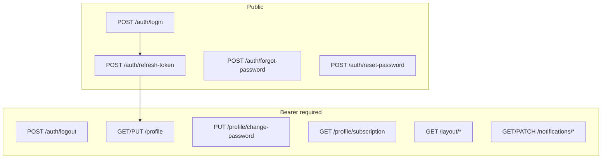
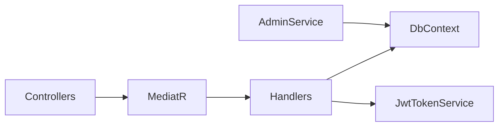

---
todos:
  - id: bprep-di
    status: completed
    content: 'Add EF SQLite, MediatR, FluentValidation, CORS, JWT TTL, ProblemDetails wiring in Program.cs + appsettings'
  - id: domain-ef
    status: completed
    content: 'Domain entities (Role, User full, RefreshToken, PasswordResetToken, Notification) + TicketDbContext + seed + migration'
  - id: auth-slice
    status: completed
    content: 'Auth CQRS: login/refresh/logout/forgot/reset + JwtTokenService + AuthController'
  - id: profile-notif
    status: completed
    content: 'Profile, Layout, Notifications handlers + controllers per SC-10.3–10.5'
  - id: admin-ef
    status: completed
    content: Replace InMemoryAdminService with EfAdminService on shared DbContext
  - id: verify-pr
    status: completed
    content: 'Build, Phase 0 DoD smoke, FE handoff, push branch + PR'
name: Phase 0 Auth API
overview: پیاده‌سازی کامل Phase 0 (۱۴ endpoint Auth/Profile/Layout/Notifications) با EF Core + SQLite، JWT + refresh rotation، CQRS/MediatR، و یکپارچه‌سازی Admin موجود روی همان دیتابیس تا login برای SuperAdmin کار کند.
isProject: false
---
# Phase 0 — Auth & Common Implementation

## Current state

| Exists | Missing |
|--------|---------|
| Clean Architecture skeleton, JWT middleware, Swagger | All 14 Phase 0 routes |
| [AdminController](src/Ticket/Ticket.Api/Controllers/AdminController.cs) + in-memory [InMemoryAdminService](src/Ticket/Ticket.Infrastructure/InMemoryAdminService.cs) | Auth/Profile/Layout/Notifications controllers |
| Simplified [User](src/Ticket/Ticket.Domain/Entities.cs) (SHA256, no Phone/ClientId/RoleId) | EF Core, MediatR, FluentValidation, refresh tokens |
| JWT config in [appsettings.json](src/Ticket/Ticket.Api/appsettings.json) (no TTL/CORS) | Roles seed, PasswordResetToken, Notification entities |

**Prerequisite:** Phase B-Prep gaps (persistence + DI) are completed as part of this work — not a separate phase.

## Contract scope (14 endpoints)

From [Documents/TICKETING-SYSTEM-API-SCENARIOS-v2.md](Documents/TICKETING-SYSTEM-API-SCENARIOS-v2.md) §1 + [Documents/openapi.json](Documents/openapi.json):



Status codes follow **SCENARIOS** (not openapi ambiguity): deactivated/deleted login → **403**; bad credentials → **401** with identical message; validation → **400** with `errors` map.

## Locked defaults (FE handoff)

| Setting | Value |
|---------|--------|
| DB | EF Core + **SQLite** file `Ticket.db` (Cloud-friendly, no Docker) |
| accessToken TTL | 15 minutes |
| refreshToken TTL | 7 days |
| CORS | `http://localhost:5173` |
| Password hashing | `PasswordHasher<User>` (replace SHA256 in Admin) |
| Forgot-password delivery | Stub logger (always 200) |

## Architecture



- **New:** MediatR Commands/Queries under `Ticket.Application/Features/{Auth|Profile|Layout|Notifications}/`
- **New:** `IApplicationDbContext`, `TicketDbContext`, `JwtTokenService`, `DbSeed`
- **Replace:** `InMemoryAdminService` → `EfAdminService` using same `Users`/`Providers`/`Plans`/`Subscriptions` tables so Phase 1 Admin and Phase 0 login share one SuperAdmin seed

## Step 1 — Packages and configuration

Add to projects:
- Infrastructure: `Microsoft.EntityFrameworkCore.Sqlite`, `Microsoft.EntityFrameworkCore.Design`
- Application: `MediatR`, `FluentValidation`, `FluentValidation.DependencyInjectionExtensions`
- Api: reference MediatR wiring

Update [Program.cs](src/Ticket/Ticket.Api/Program.cs):
- DbContext (SQLite connection from config)
- MediatR + FluentValidation auto-validation
- CORS policy
- JWT TTL from config (`AccessTokenMinutes`, `RefreshTokenDays`)
- `InvalidModelStateResponseFactory` → `ValidationProblemDetails`
- Migrate + seed on startup (Development)
- Swagger Bearer security scheme

Update [appsettings.json](src/Ticket/Ticket.Api/appsettings.json):
```json
"ConnectionStrings": { "Default": "Data Source=Ticket.db" },
"Jwt": { "AccessTokenMinutes": 15, "RefreshTokenDays": 7 },
"Cors": { "Origins": ["http://localhost:5173"] }
```

## Step 2 — Domain entities (DESIGN §5 + Phase 0)

Extend/replace [Entities.cs](src/Ticket/Ticket.Domain/Entities.cs):

- `Role` (seed 1–5 per DESIGN §5.3)
- `User`: `RoleId`, `PhoneNumber`, `ClientId?`, `PassHash`, `UpdatedAt`, `LastAssignedAt?` (Agent field, nullable for now)
- `RefreshToken`: `UserId`, token hash, `ExpiresAt`, `IsRevoked`
- `PasswordResetToken`: `UserId`, `Token`, `ExpireAt`, `IsUsed`
- `Notification` + `NotificationType` enum (persist int, JSON string)
- Keep existing `Provider`, `Plan`, `ProviderSubscription` for Admin EF migration

Add all role name constants: `SuperAdmin`, `ProviderManager`, `Agent`, `ClientManager`, `Requester`.

## Step 3 — Persistence

- `Ticket.Infrastructure/Persistence/TicketDbContext.cs` + `IApplicationDbContext` in Application
- EF configurations (unique `Username`, soft-delete filters where needed)
- Migration: `Phase0_Auth` (report command; apply on dev startup)
- **Seed:** Roles 1–5 + SuperAdmin (`superadmin` / `ChangeMe123!`) via `PasswordHasher`

## Step 4 — Auth feature slice

Handlers + validators + DTOs matching openapi schemas:

| Endpoint | Handler behavior |
|----------|-------------------|
| `POST /auth/login` | Verify password; check `IsActive`/`IsDeleted`; if user has `ProviderId`, fail login when Provider inactive; issue JWT + refresh; return `LoginResponse` |
| `POST /auth/refresh-token` | Rotate refresh token; expired/reused → 401 |
| `POST /auth/logout` | Revoke refresh (idempotent 200); requires Bearer |
| `POST /auth/forgot-password` | Create reset token if user exists; always 200 |
| `POST /auth/reset-password` | Validate token expiry/used; update password |

JWT claims: `sub`/`userId`, `roleName`, `providerId?`, `clientId?`.

## Step 5 — Profile / Layout / Notifications

| Endpoint | Rules |
|----------|-------|
| `GET/PUT /profile` | Current user from JWT; `orgName` = Provider or Client name |
| `PUT /profile/change-password` | Wrong current → 401 |
| `GET /profile/subscription` | ProviderManager only → 403 others; no active sub → 404 |
| `GET /layout/profile-summary` | `fullName`, `roleName`, `avatarUrl: null` |
| `GET /layout/notifications/unread-count` | Count unread for current user |
| `GET /notifications` | Paged; `search`, `onlyUnread`, 1-based `pageNumber` |
| `PATCH /notifications/{id}/read` | Own notification only → else 404 |
| `PATCH /notifications/read-all` | Always 200 |

## Step 6 — Controllers

Create thin controllers (route prefix `api/v1`):
- `AuthController` — `[AllowAnonymous]` on public actions; logout requires auth
- `ProfileController`, `LayoutController`, `NotificationsController` — `[Authorize]`

Keep [AdminController](src/Ticket/Ticket.Api/Controllers/AdminController.cs) unchanged in routes; swap DI to `EfAdminService`.

## Step 7 — Migrate Admin to EF

Replace [InMemoryAdminService](src/Ticket/Ticket.Infrastructure/InMemoryAdminService.cs) with `EfAdminService`:
- Same `IAdminService` interface
- Use `PasswordHasher` for create-provider manager password
- Transaction for Create Provider + ProviderManager user
- Remove SHA256 helper

## Step 8 — Verify + handoff

Per [verify-feature](.cursor/skills/verify-feature/SKILL.md):

```powershell
rtk dotnet build src/Ticket/Ticket.slnx
```

Smoke tests:
- Login SuperAdmin → GET profile → refresh rotate → logout
- Validation 400 on login empty fields
- No bearer → 401
- Forgot password always 200

**FE handoff note:** credentials, TTL, CORS, Swagger URL, sample JWT flow.

Work on branch `cursor/phase-0-auth-3282`, commit, push, open PR.

## Out of scope

- Phase 2–6 routes
- SignalR
- Real email/SMS for password reset
- Full CQRS rewrite of Admin (keep `IAdminService` facade; only persistence swap)
