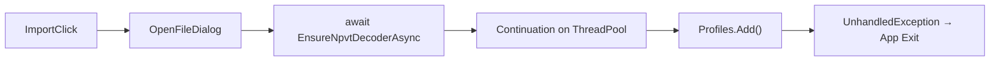
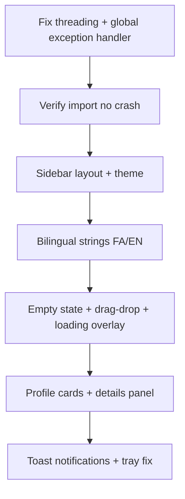

# بازطراحی UI + رفع بسته شدن برنامه هنگام Import

## تشخیص مشکل Import (crash)

علت اصلی بسته شدن برنامه با احتمال بالا: **تغییر `ObservableCollection` از thread پس‌زمینه** بعد از `await` در import.

```379:391:D:\napsterProject\src\NapsternetVClient\ViewModels\MainViewModel.cs
private void AddImportedProfiles(IReadOnlyList<ServerProfile> imported)
{
    foreach (var profile in imported)
    {
        _profileService.Add(profile);
        Profiles.Add(profile);  // crash: not on UI thread
    }
    SelectedProfile = imported[0];
}
```

همین مشکل در `AppendLog` وقتی از `Progress<string>` حین دانلود decoder صدا زده می‌شود هم وجود دارد. WPF در این حالت `InvalidOperationException` می‌دهد و چون handler سراسری نداریم، **کل برنامه می‌بندد**.



### Fix (فاز 1 — بحرانی)

| تغییر | فایل |
|-------|------|
| همه به‌روزرسانی UI بعد از async فقط روی Dispatcher | [`MainViewModel.cs`](D:\napsterProject\src\NapsternetVClient\ViewModels\MainViewModel.cs) |
| helper: `RunOnUiAsync(Action)` | همان فایل یا `UiDispatcher.cs` جدید |
| `DispatcherUnhandledException` + `AppDomain.UnhandledException` — log + MessageBox، **بدون shutdown** | [`App.xaml.cs`](D:\napsterProject\src\NapsternetVClient\App.xaml.cs) |
| `ConfigureAwait(true)` در مسیر import (اختیاری، مکمل Dispatcher) | [`NpvtDecoder.cs`](D:\napsterProject\src\NapsternetVClient\Parsers\NpvtDecoder.cs), `BinaryManager` |

---

## مشکلات UX فعلی (از screenshot)

- پس‌زمینه سفید/نامتجانس — `Grid` ریشه [`MainWindow.xaml`](D:\napsterProject\src\NapsternetVClient\Views\MainWindow.xaml) بدون `Background` تعریف‌شده
- لیست Profiles خالی بدون راهنما — کاربر نمی‌داند چه کار کند
- نمایش profile فقط `ToString()` — `[Vmess] name (host:port)` بدون جزئیات
- toolbar شلوغ — دکمه‌ها پراکنده، Mode combo ناخوانا
- خطا فقط MessageBox — تجربه ناگهانی و سخت

---

## طراحی جدید (سبک Sidebar + دو زبانه)

```
┌─────────────────────────────────────────────────────────┐
│  NapsternetV Client          [FA|EN]        [_ □ ×]    │
├──────────────┬──────────────────────────────────────────┤
│  Profiles    │  Profile Details                         │
│  ─────────   │  Name, Protocol, Server, Port, Transport  │
│  + Import    │  [Import File] [Import Link]             │
│  ─────────   │                                          │
│  ● Server 1  │  (empty state: illustration + hint)      │
│    Server 2  │  "فایل .npvt را import کنید"             │
│              │  "Import your .npvt config to begin"     │
├──────────────┴──────────────────────────────────────────┤
│  Mode: [Proxy ●] [TUN ○]     [  Connect  ]   Status: ●  │
│  Log ▼ (collapsible)                                    │
└─────────────────────────────────────────────────────────┘
```

### ساختار layout

| ناحیه | عرض | محتوا |
|-------|-----|--------|
| Sidebar چپ | ~240px | لیست پروفایل + دکمه Import |
| Main panel | * | جزئیات پروفایل انتخاب‌شده یا empty state |
| Bottom bar | Auto | Mode toggle + Connect/Disconnect + status indicator |
| Log drawer | 180px (collapsible) | log با دکمه جمع/باز |

---

## پیاده‌سازی UI (فاز 2)

### فایل‌های جدید

| فایل | نقش |
|------|-----|
| [`Resources/Strings.resx`](D:\napsterProject\src\NapsternetVClient\Resources\Strings.resx) | English |
| [`Resources/Strings.fa.resx`](D:\napsterProject\src\NapsternetVClient\Resources\Strings.fa.resx) | فارسی |
| [`Services/LocalizationService.cs`](D:\napsterProject\src\NapsternetVClient\Services\LocalizationService.cs) | تعویض FA/EN + `FlowDirection` |
| [`Converters/BoolToVisibilityConverter.cs`](D:\napsterProject\src\NapsternetVClient\Converters\BoolToVisibilityConverter.cs) | empty state |
| [`Views/ProfileListItem.xaml`](D:\napsterProject\src\NapsternetVClient\Views\ProfileListItem.xaml) | کارت کوچک: نام + protocol badge |
| [`Views/ProfileDetailsPanel.xaml`](D:\napsterProject\src\NapsternetVClient\Views\ProfileDetailsPanel.xaml) | جزئیات خوانا (بدون نمایش password/uuid) |

### تغییرات [`MainWindow.xaml`](D:\napsterProject\src\NapsternetVClient\Views\MainWindow.xaml)

- `Grid` سه ستونه: Sidebar | Content | (none)
- `FlowDirection` bind به زبان (RTL برای FA)
- رنگ‌بندی یکپارچه تیره: `#0D1117` background, `#161B22` panels, `#238636` connected, `#DA3633` disconnect
- **Empty state** وقتی `Profiles.Count == 0`: آیکون + متن دو زبانه + drag-drop zone برای `.npvt`
- **Loading overlay** وقتی `IsBusy`: spinner + "در حال import… / Importing…"
- Log panel با `Expander` یا toggle — پیش‌فرض بسته

### ViewModel

[`MainViewModel.cs`](D:\napsterProject\src\NapsternetVClient\ViewModels\MainViewModel.cs):

- `IsEmpty` computed property
- `SelectedProfileDetails` — مدل نمایشی بدون secret
- `ToggleLanguageCommand` — FA ↔ EN
- `IsLogExpanded` — جمع/باز log
- `ImportProgressMessage` — وضعیت import در overlay
- همه property/commandها از Dispatcher

---

## بهبود Import UX (فاز 3)

| بهبود | توضیح |
|-------|--------|
| Drag & Drop | `MainWindow` — `Drop` handler برای `.npvt`, `.npv4` |
| Import موفق | Snackbar/toast سبز: "Config imported" / "کانفیگ import شد" — **بدون بستن پنجره** |
| Import ناموفق | inline error در panel + log — MessageBox فقط برای خطاهای بحرانی |
| Password | دیالوگ [`PasswordDialog`](D:\napsterProject\src\NapsternetVClient\Views\PasswordDialog.xaml) با استایل هماهنگ + متن FA/EN |
| npvt-decoder | progress bar در overlay هنگام دانلود |

---

## Fixهای جانبی

- **Tray behavior**: Minimize to tray فقط با minimize — بستن (X) واقعاً exit کند (یا از کاربر بپرسد) تا گیج‌کننده نباشد
- **ComboBox Mode** → **Radio/Toggle** برای خوانایی بهتر
- **Connect/Disconnect**: Disconnect فقط وقتی connected فعال (الان هم هست ولی visually بهتر)
- **ProfileService**: `SaveLocked` در try/catch — خطای DPAPI نباید crash کند

---

## ترتیب اجرا



---

## معیار پذیرش

- Import `.npvt` → برنامه **نباید** ببندد؛ profile در sidebar ظاهر شود
- UI دو زبانه با toggle FA/EN و RTL در حالت فارسی
- Empty state واضح برای کاربر تازه
- Layout sidebar تمیز — Connect بزرگ و در دسترس در bottom bar
- Log پیش‌فرض جمع‌شده — UI ساده‌تر به نظر برسد
